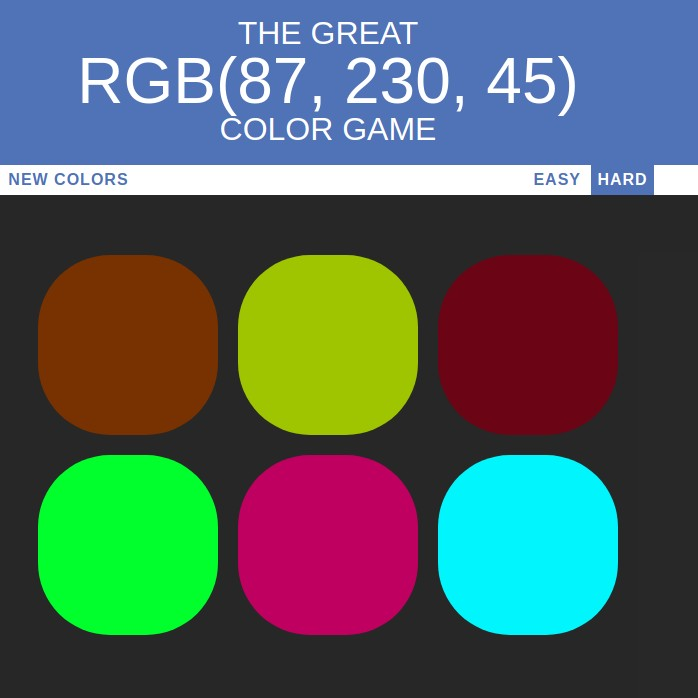
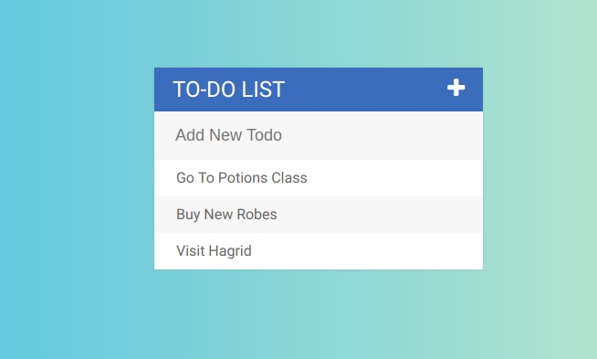

This is a directory that i made that has multiple beginner stuff i did when i started the journey of Web Development .
This file should contain the basics of HTML , CSS , JavaScript , JQuery.

The first Directory which is called Color Game is a game that the player is given a random RGB (red , green , blue) numbers and they have to guess from the given choices which color is it you shoudl try it its really fun !

The second Directory contains a simple To Do List that is has some really cool effects and looks to it using CSS and JS. Moreover, it has all the basics of these languages hope you like it.

There might be more files on web development in the future , so thats not everything , i will add my fullstack projects on the MEN stack -> MongoDB , Express.js , Node.js , and some manipulation in APIs 
This is the link where most of these projects are : https://preview.c9users.io/adnanasali/fullstack-course-1
# Color-Game
